# 📦 Equipment Borrowing and Management App


---

## 📖 Overview
Equipment Borrowing And Management System is an Android application built with **Kotlin**, **Jetpack Compose**, and **Firebase** for managing equipment borrowing in an academic or lab environment.

The system supports two user roles:
- 🎓 **Student**
- 🛠️ **Admin**

Students can browse available equipment, submit borrowing requests, view their request history, check lab computer information, and report software issues.  
Admins can manage equipment, review borrowing requests, manage lab computers, track software status, and review reported issues.

---

## ✨ Features

### 🔑 Authentication
- User registration & login  
- Role-based access control  
- Separate dashboards for Admin & Student  

### 🎓 Student Features
- View available equipment  
- Submit borrow requests  
- View personal request history  
- View lab computer list  
- Report software-related issues  

### 🛠️ Admin Features
- Dashboard statistics  
- Add, edit, and manage equipment  
- Approve or reject borrowing requests  
- Mark returned equipment  
- Manage lab computers  
- Track software status  
- Review software issue reports  

### 🎨 UI and State Management
- Loading screen  
- Empty state screen  
- Error state screen  
- Retry support for failed screens  
- Snackbar-based user feedback  

---

## 🛠️ Tech Stack
- **Kotlin**  
- **Jetpack Compose**  
- **Firebase Authentication**  
- **Cloud Firestore**  
- **Android Studio**  

---

## 📂 Project Structure

```text
com/example/equipmentborrowingapp/
├── data/
│   ├── model/
│   └── repository/
├── navigation/
├── ui/
│   ├── admin/
│   ├── auth/
│   ├── common/
│   ├── student/
│   └── theme/
├── utils/
└── screenshots/

## 📱 App Screenshots

### 🔑 Authentication
| Splash Screen | Login | Register |
|---------------|-------|----------|
| 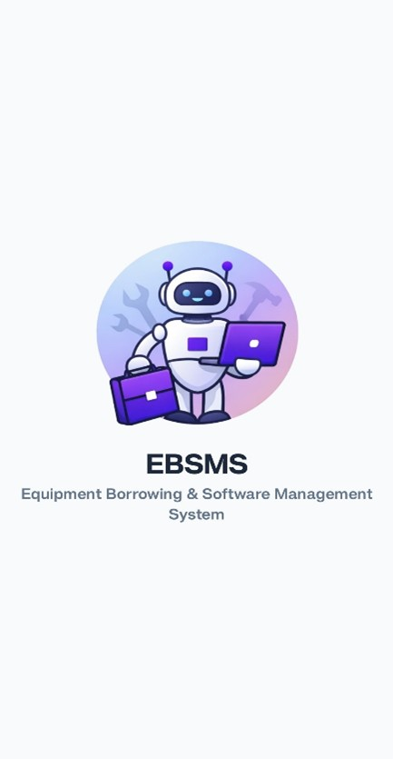 | 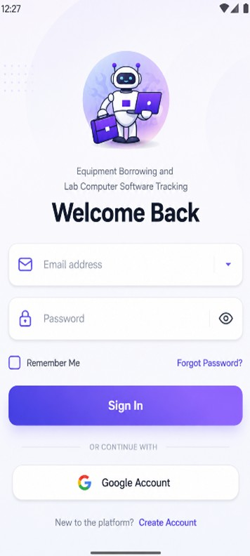 | 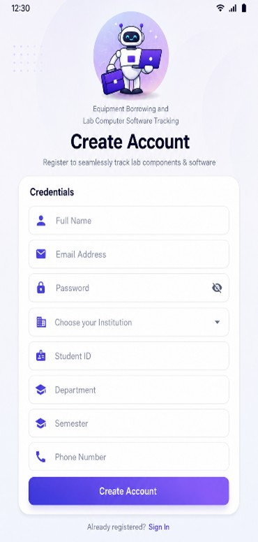 |

---

### 🎓 Student Features
| Student Dashboard | Equipment List | Equipment Details |
|-------------------|----------------|-------------------|
| 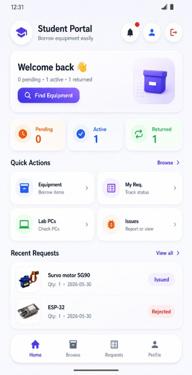 | 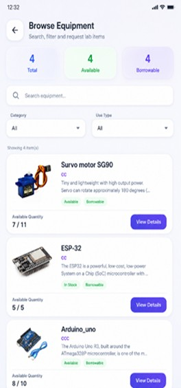 | 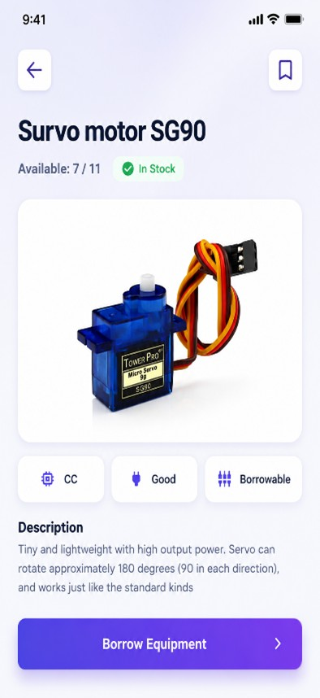 |

| Borrow Request | Submit Request | My Requests |
|----------------|----------------|-------------|
| 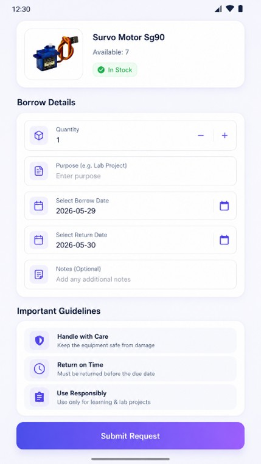 | 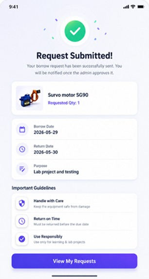 | 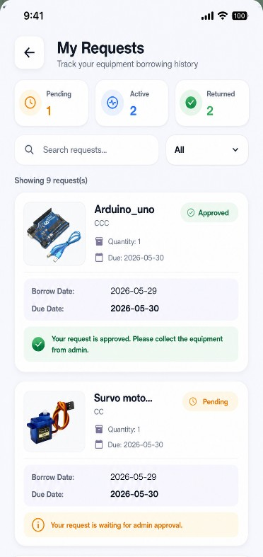 |

| Room Selection | Report Software Issue |
|----------------|------------------------|
| 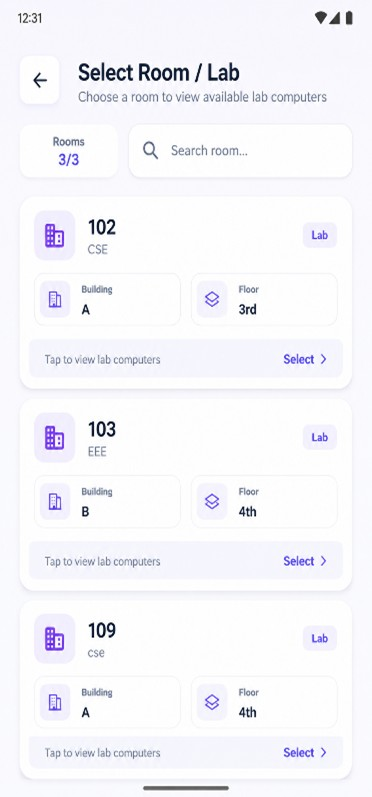 | 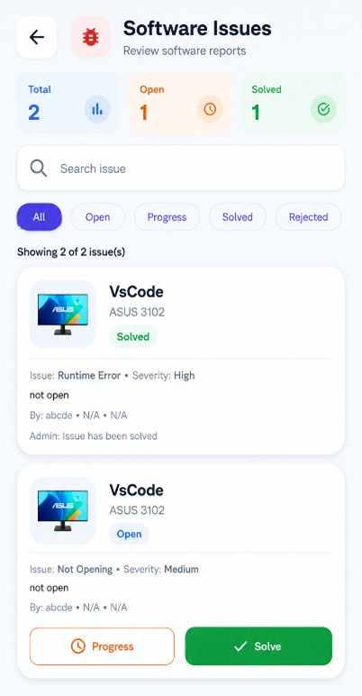 |

---

### 🛠️ Admin Features
| Admin Dashboard | Manage Equipment | Pending Requests |
|-----------------|------------------|------------------|
| 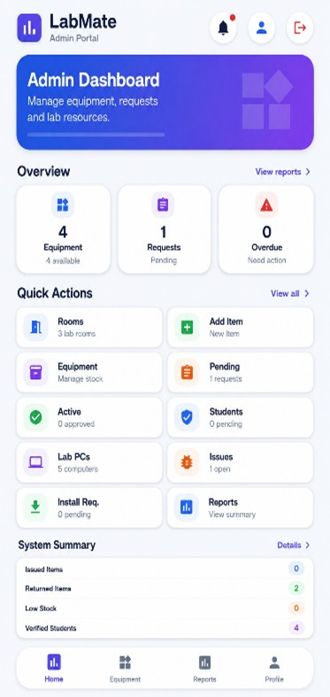 | 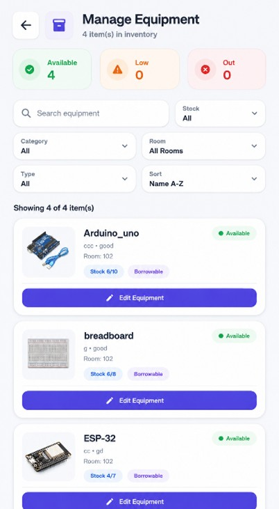 | 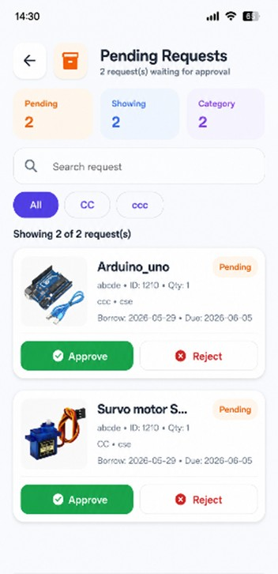 |

| Lab Computers |
|---------------|
| 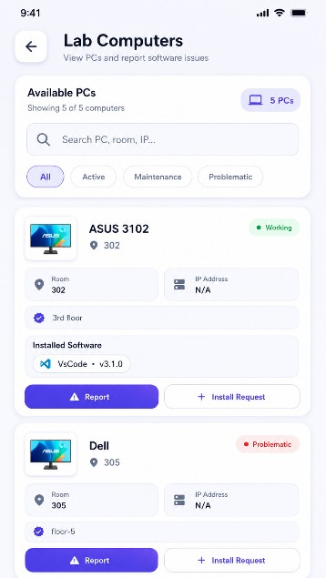 |
